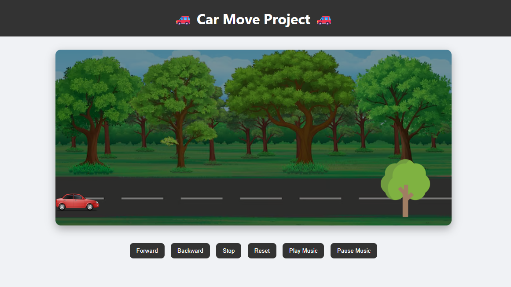

# 🚗 Car Move Project  

An interactive **Car Move Project** built using **HTML, CSS, and JavaScript**, where users can control the movement of a car with fun animations and sound effects.  

---

## 📸 Demo Screenshot  
  

---

## ✨ Features  
- 🚘 Move the car **forward & backward**  
- ⏹️ **Stop & Reset** functionality  
- 🎶 Integrated **music & crash effects**  
- ⚡ Smooth animations using CSS & JS  
- 🖥️ Simple, beginner-friendly code  

---

## 🛠 Tech Stack  
- **HTML5** – Structure of the project  
- **CSS3** – Styling & animations  
- **JavaScript (ES6)** – DOM manipulation, events, and logic  

---
